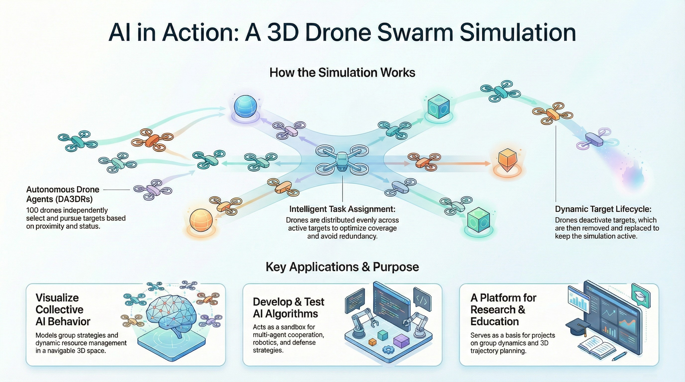

# Drone Swarm Simulation


## **Introduction**

This repository extends prior developments to produce high-fidelity simulations of AI systems. Core objectives encompass visualization of emergent collective AI behaviors, implementation and validation of AI algorithms, and establishment of a dedicated research and education platform. Development remains in initial phases, with modular components to be incrementally constructed and integrated.


<p align="center">

</p>


## **Detailed Python Program Descriptions**

### What the program actually does ?

- It simulates an environment where agents (drones) explore, identify, pursue, and "attack" targets, illustrating group strategies and dynamic task assignment in artificial intelligence.

- It allows visualization of collective agent behavior and dynamic resource (target) management in a 3D space.

- It provides a foundation for experimenting with AI algorithms for coordination, trajectory optimization, or target management in robotics or military scenarios.

### Potential Uses

This type of simulation can be used to:

- Test and develop multi-agent cooperation strategies.

- Visualize AI algorithms for collective robotics or defense.

- Serve as a basis for research or teaching projects on group dynamics, target management, or 3D trajectory planning.

- "Exploring and integrating targeted combat strategies using artificial intelligence. This project is currently in the development phase. I will gradually incorporate effective solutions as progress is made." 


### **Descriptions**

#### SimuDataLemAI.py: 

This program is a set of interactive 3D simulations written in Python using Pyglet and PyOpenGL to study collective robotics and defense-oriented AI strategies. The simulations model fleets of “drone avatars” (DA3DRs) evolving in a closed 3D space with both fixed and mobile targets, emphasizing group dynamics, target lifecycle management, and adaptive agent behaviour. They provide a playground for experimenting with multi-agent coordination, trajectory planning, and target allocation algorithms, and can be used for research, teaching, or visual demonstrations of AI in collective robotics and defense scenarios

#### SimuDronesCampaignLemAI_Level1.py 

This program is a configurable 3D drone battle simulator where blue and red squads fight on a 100×100 map with realistic movement, firing, battery usage, ammo limits, collision avoidance, and interception events. It includes adaptive enemy AI (aggressive, defensive, or deceptive) that learns from previous outcomes, Sun Tzu–inspired positional and influence models, and a tunable player controller for tactics like preferred distance and aggressiveness. Battles are turn-based (up to 5000 turns) with 3D Matplotlib animation for trajectories and loss counters, and the simulator also provides 2D ground tracks, altitude‑vs‑time plots, and influence heatmaps at key turns. Every shot and drone state is logged to export quantitative statistics (hit rates, distance distributions, battery usage, interception times), making the script suitable for experimenting with swarm tactics and drone warfare strategies simply by adjusting configuration parameters and drone counts in the CONFIG block and main entry point.

---

##### Conceptual Diagram: Program Structure and Enemy AI Flow

```
+----------------------------------------------------------------+
| SimuDronesCampaignLemAI_Level1.py                              |
| Configurable 3D drone battle + AI + visualization              |
+-------------------------------+--------------------------------+
                                |
                                v
+-------------------------------+--------------------------------+
| CONFIG                                                         |
| - Scenario (map, turns, N drones)                              |
| - Drone dynamics (speed, accel)                                |
| - Volume constraints (altitude, NFZ)                           |
| - Weather presets (wind, turbulence)                           |
| - Visualization / heatmap turns                                |
+-------------------------------+--------------------------------+
                                |
                                v
+-------------------------------+--------------------------------+
| Data & State Classes                                           |
| - DroneUnit                                                    |
|   (3D pose, HP, battery, ammo, dynamics state, team)           |
| - DroneScenarioState                                           |
|   (drones, turn, history,influence grids, shot_events)         |
| - CampaignState                                                |
|   (global logs, weather label, enemy_ai, player_controls)      |
+-------------------------------+--------------------------------+
                                |
                                v
+-------------------------------+--------------------------------+
| AI Components                                                  |
| - EnhancedEnemyAI                                              |
|   (personality, memory, recommend_drone_action)                |
| - PlayerDroneController                                        |
|   (uses player_controls:                                       |
|    personality, aggressiveness, preferred distance)            |
| - ChessSunTzuAI                                                |
|   (positional score per team)                                  |
| - GoSunTzuAI                                                   |
|   (influence grids, encirclement detection)                    |
+-------------------------------+--------------------------------+
                                |
                                v
+-------------------------------+--------------------------------+
| Environment & Physics                                          |
| - VolumeConstraints                                            |
|   (altitude limits, NFZ)                                       |
| - Weather                                                      |
|   (wind, turbulence, battery_factor)                           |
| - update_drone_dynamics                                        |
|   (inertia, accel, yaw, climb)                                 |
| - apply_weather,                                               |
|   apply_volume_constraints,                                    |
|   update_battery                                               |
| - apply_collision_avoidance                                    |
+-------------------------------+--------------------------------+
                                |
                                v
+-------------------------------+--------------------------------+
| Main Simulation Loop                                           |
| run_drone_campaign()                                           |
|  1. Check is_battle_over                                       |
|  2. Evaluate position                                          |
|     (ChessSunTzuAI, GoSunTzuAI)                                |
|  3. For each drone:                                            |
|     - Enemy: EnhancedEnemyAI                                   |
|     - Player: PlayerController                                 |
|  4. Apply collision avoidance                                  |
|  5. Integrate dynamics + env                                   |
|  6. Firing phase: hit/miss,                                    |
|     damage, interception,                                      |
|     log shot_events                                            |
|  7. Snapshot state to history                                  |
+-------------------------------+--------------------------------+
                                |
                                v
+-------------------------------+--------------------------------+
| Statistics & Visualization                                     |
| - export_battle_stats()                                        |
|   (hit rates, distance, battery, intercept times)              |
| - visualize_drone_battle_3d()                                  |
| - visualize_drone_2d_tracks()                                  |
| - visualize_influence_heatmaps()                               |
+----------------------------------------------------------------+

```

---

##### Enemy AI Decision Flow

```
+--------------------------------------------------------+
| EnhancedEnemyAI                                        |
| Role: tactical controller for red drones               |
+------------------------+-------------------------------+
                         |
                         v
+--------------------------------------------------------+
| 1. Update personality                                  |
|    after each battle                                   |
| observe_outcome()                                      |
|  - Append result to                                    |
|    memory (limited size)                               |
| decide_personality()                                   |
|  - Compute win rate                                    |
|  - If win_rate > 0.7:                                  |
|       personality = AGGRESSIVE                         |
|  - If win_rate < 0.3:                                  |
|       personality = DEFENSIVE                          |
|  - Else:                                               |
|       personality = DECEPTIVE                          |
+------------------------+-------------------------------+
                         |
                         v
+------------------------+-------------------------------+
| 2. Per-turn decision                                   |
|    for each enemy drone recommend_drone_action()       |
+------------------------+-------------------------------+
                         |
                         v
+------------------------+-------------------------------+
| 2.1 Perception                                         |
| - Collect enemy drones                                 |
|   (blue team) from DroneScenarioState                  |
| - If none: return zero velocity, no shot               |
+------------------------+-------------------------------+
                         |
                         v
+------------------------+-------------------------------+
| 2.2 Target selection                                   |
| - Choose closest blue  drone (min distance)            |
| - Compute distance                                     |
+------------------------+-------------------------------+
                         |
                         v
+--------------------------------------------------------+
| 2.3 Behavior by personality                            |
+------------------------+-------------------------------+
| aggressive             | defensive                     |
| - Compute vector       | - Compute desired stand-off   |
|   _vector_towards()    |   distance (weapon_range*0.7) |
|   (full speed)         | - If too close:               |
| - If in weapon range   |     _vector_away()            |
|   and ammo>0:          |   else:                       |
|   shoot = target       |     _vector_towards() (slower)|
+------------------------+-------------------------------+
| deceptive                                              |
| - If drone HP < 40:                                    |
|     _vector_away() (escape)                            |
| - Else:                                                |
|     _flank_vector() (lateral maneuver)                 |
| - Shooting thresholds slightly more conservative       |
+--------------------------------------------------------+
                         |
                         v
+--------------------------------------------------------+
| 2.4 Output                                             |
| - desired velocity (vx,vy, vz) scaled by               |
|   dyn_max_speed / climb                                |
| - optional target to fire at if:                       |
|   distance within personality-specific firing window   |
|   AND ammo > 0                                         |
+--------------------------------------------------------+

```


Note: I will be adding the improvements soon...
In the meantime, I invite you to check out my other repository: https://github.com/lemoinep/SunTzuMilitaryCampaignSimulator


